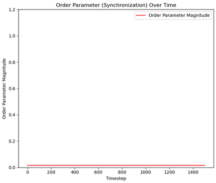
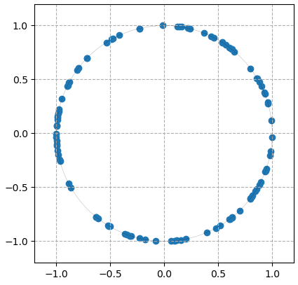
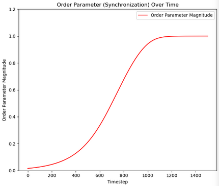
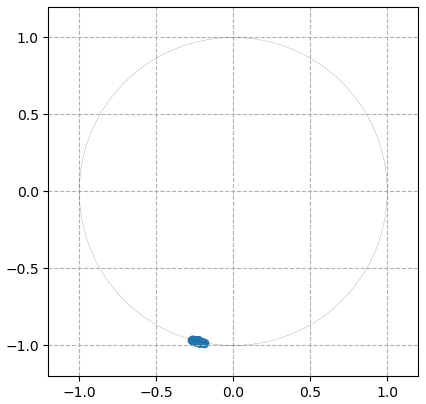

# Kuramoto model
*kuramoto.cpp file contains the main code, ANALYSIS.ipynb contains the analysis using python.*

### Parameters
number of oscillators = 100 \
frequency of each oscillators = 0.5\
dt = 10^-6\
number of iterations = 1.5e5

### Results

for coupling strength = 99
> Order Parameter\

> Phase Diagram\

for coupling strength = 100
> Order parameter\

> Phase Diagram\

Thus, the critical value for coupling strength is 100. 